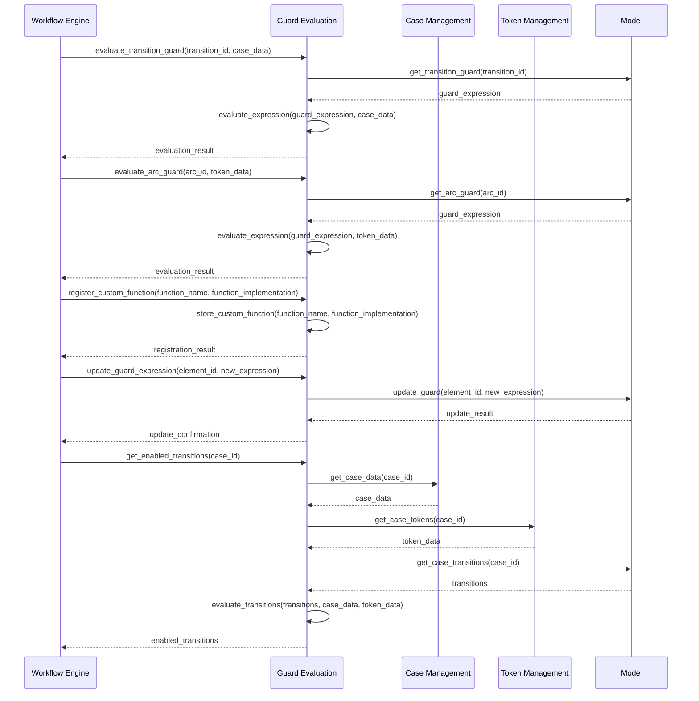
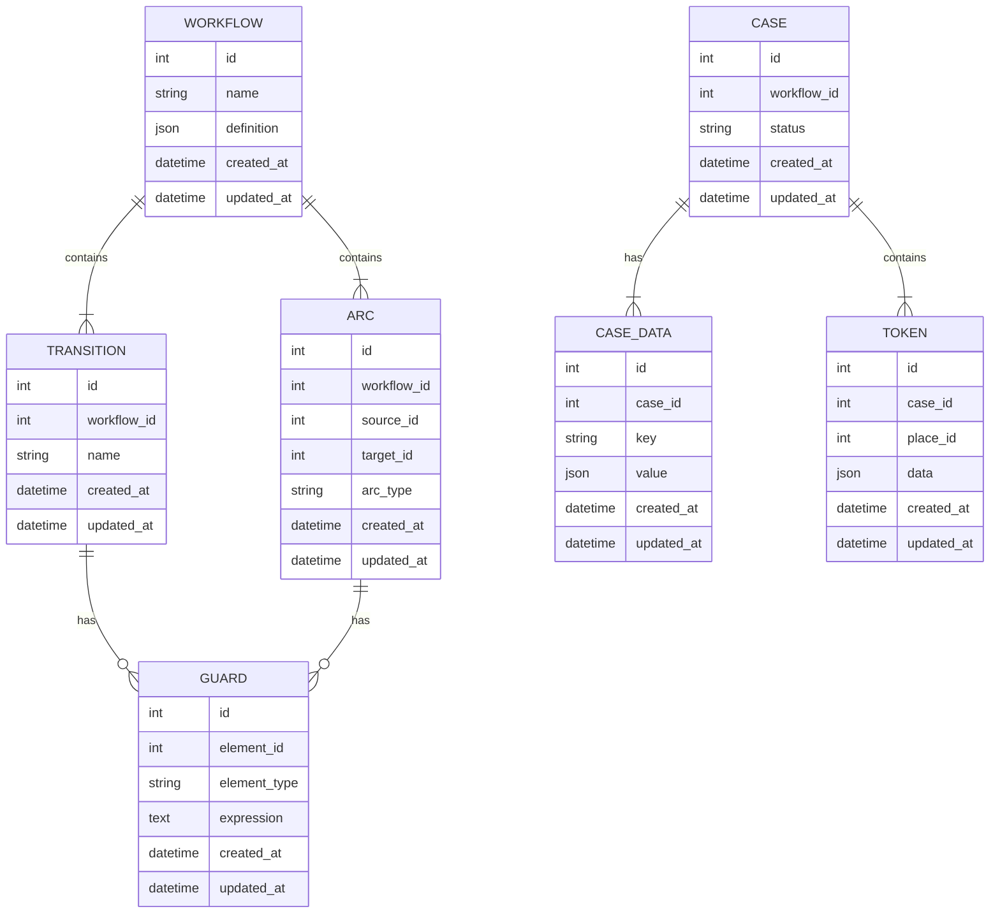

# Guard Evaluation

Guard Evaluation is a crucial component of the Petri Flow Engine, responsible for evaluating conditions for transitions and arcs in the Petri net structure. This document outlines the main APIs exposed by Guard Evaluation, illustrates the sequence of operations triggered by these APIs, and describes the data schema used.

## Exposed APIs

1. `evaluate_transition_guard(transition_id, case_data)`
   - Evaluates the guard condition for a specific transition using the current case data.

2. `evaluate_arc_guard(arc_id, token_data)`
   - Evaluates the guard condition for a specific arc using the token data.

3. `register_custom_function(function_name, function_implementation)`
   - Registers a custom function that can be used in guard expressions.

4. `update_guard_expression(element_id, new_expression)`
   - Updates the guard expression for a transition or arc.

5. `get_enabled_transitions(case_id)`
   - Retrieves all transitions that are currently enabled for a given case.

## Sequence Diagram

## Entity Diagram

This entity diagram represents the core data schema used by the Guard Evaluation component:

- WORKFLOW: Represents the overall workflow definition.
- TRANSITION: Represents transitions in the Petri net.
- ARC: Represents arcs connecting places and transitions.
- GUARD: Stores guard expressions for transitions and arcs.
- CASE: Represents an instance of a workflow.
- CASE_DATA: Stores data associated with a specific case.
- TOKEN: Represents individual tokens within a case.

The relationships between these entities are as follows:
- A WORKFLOW contains multiple TRANSITIONs and ARCs.
- TRANSITIONs and ARCs can have GUARDs.
- A CASE is associated with a WORKFLOW and contains CASE_DATA and TOKENs.

This schema allows for efficient storage and retrieval of guard expressions, as well as the necessary data to evaluate these guards in the context of specific cases and tokens. The Guard Evaluation component can use this structure to perform its core functions of evaluating transition and arc guards, managing custom functions, and determining enabled transitions for workflow execution.
