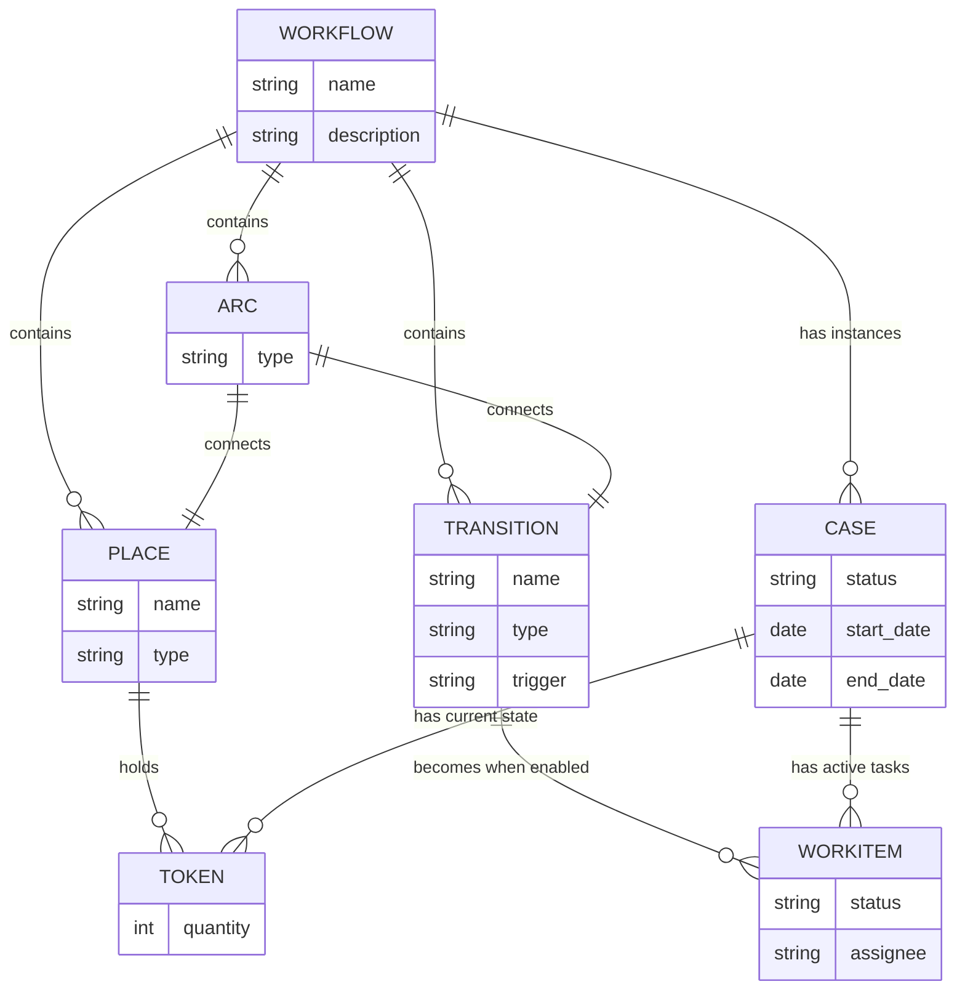

## Entity Relationships
1. A WORKFLOW contains multiple PLACEs, TRANSITIONs, and ARCs.
2. A WORKFLOW can have multiple CASE instances.
A PLACE can hold multiple TOKENs.
3. A TRANSITION can become multiple WORKITEMs when enabled.
4. An ARC connects either a PLACE to a TRANSITION or a TRANSITION to a PLACE.
5. A CASE has multiple TOKENs representing its current state.
6. A CASE has multiple WORKITEMs representing active tasks.

## Entity Descriptions

1. WORKFLOW: Represents the overall process definition.
2. PLACE: Represents a state or condition in the workflow.
3. TRANSITION: Represents an activity or task that can change the state of the workflow.
4. ARC: Connects places and transitions, defining the flow of the process.
5. TOKEN: Represents the current state of a case within a place.
6. CASE: An instance of a workflow execution.
7. WORKITEM: A task that needs to be performed, derived from an enabled transition.
This ER diagram and description provide a high-level overview of the relationships between the main entities in a Petri net-based workflow system. It captures the essence of how workflows are structured and how individual cases progress through the defined process.

