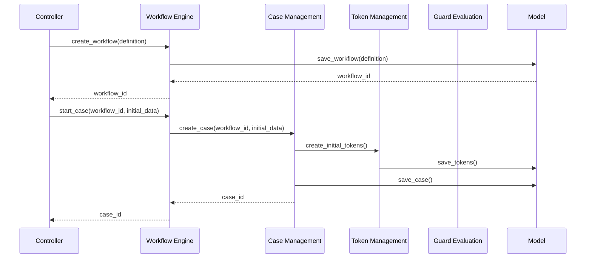
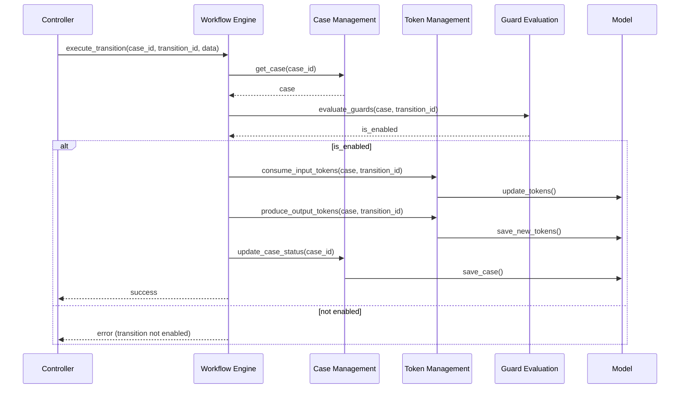

# Workflow Engine

The Workflow Engine is a core component of the Petri Flow system, responsible for managing the overall workflow process. This document outlines the main APIs exposed by the Workflow Engine and illustrates the sequence of operations triggered by these APIs.

## Exposed APIs

1. `create_workflow(definition)`
   - Creates a new workflow based on the provided definition.

2. `start_case(workflow_id, initial_data)`
   - Starts a new case for a given workflow with initial data.

3. `execute_transition(case_id, transition_id, data)`
   - Executes a specific transition for a given case.

4. `get_case_status(case_id)`
   - Retrieves the current status of a case.

5. `get_enabled_transitions(case_id)`
   - Returns a list of currently enabled transitions for a case.

6. `update_case_data(case_id, data)`
   - Updates the data associated with a case.

## Sequence Diagrams

### Creating and Starting a Workflow

### Executing a Transition

These sequence diagrams illustrate the main interactions between the Workflow Engine and other components of the Petri Flow system when creating a workflow, starting a case, and executing a transition. The Workflow Engine coordinates with Case Management, Token Management, and Guard Evaluation to ensure proper execution of the workflow process.

The APIs and sequences presented here provide a high-level overview of the Workflow Engine's functionality. Actual implementation may include additional error handling, logging, and more complex interactions depending on the specific requirements of the Petri Flow system.
